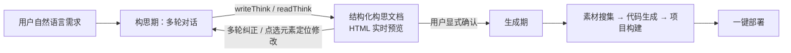
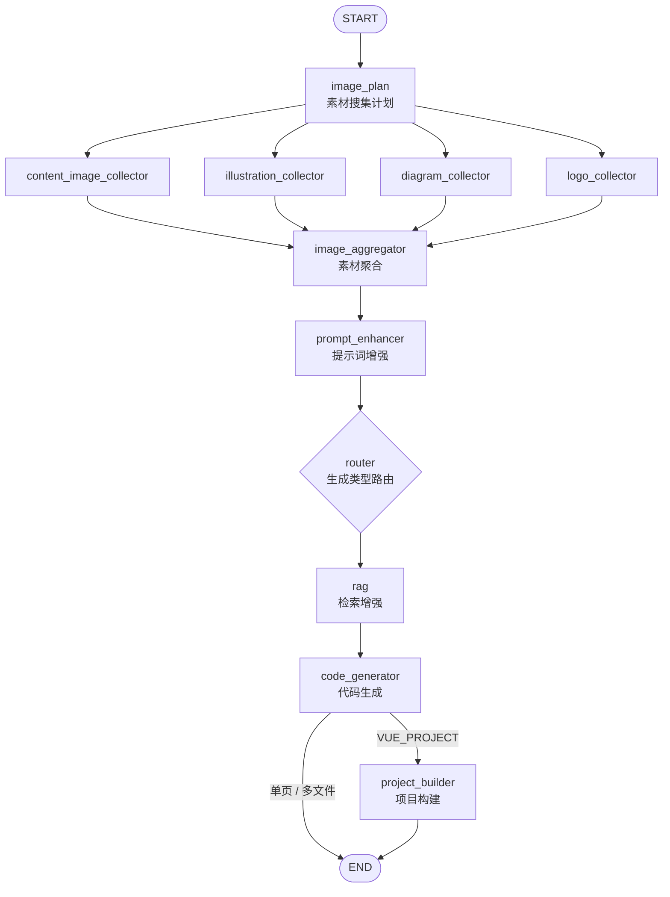

# AI Start — AI 零代码应用生成平台


用自然语言描述需求，AI 将其沉淀为结构化构思文档；经你确认后，自动完成素材搜集、代码生成、项目构建与一键部署。

你只需要说清楚"想要什么"，剩下的交给 AI。

## 核心特性

- **构思 - 生成双阶段模式**
  - 构思期：AI 通过自定义 `writeThink` / `readThink` 工具将需求沉淀为结构化构思文档，实时渲染 HTML 预览；支持多轮纠正与**点选元素定位修改**
  - 生成期：用户显式确认后进入，生成策略（单页 HTML / 多文件 / Vue 项目）由 AI 自动路由
- **直连流式 + 工作流编排双通道**
  - 直连通道：流式输出 AI 响应与工具调用过程，Agent 执行步骤实时透明
  - 工作流通道：基于 LangGraph4j 编排（条件边、并发素材搜集分支），生成期以 SSE 推送节点级进度
- **RAG 检索增强**
  - 知识文档分割与向量化（DashScope `text-embedding-v3`）
  - 按阶段差异化检索：构思期取业务场景语料，生成期取编码规范语料
  - 既作为工作流节点、又作为 AI 工具接入两条通道
- **框架级增强**：通过同包同名类覆盖 LangChain4j 框架 8 个类，为其补上工具调用过程的流式输出能力
- **工程保障**
  - Redisson 分布式锁防止重复生成
  - `@RateLimit` + AOP 用户级令牌桶限流，控制 AI 调用成本
  - 输入 / 输出守卫（防 Prompt 注入、失败自动重试）
  - 虚拟线程执行器与 10 分钟超时控制
  - 对话记忆 Redis + 数据库双轨持久化，每次调用自动回灌

## 工作原理

### 双阶段总览



### 生成期并发工作流



## 技术栈

| 层 | 技术 |
|---|---|
| 后端框架 | Spring Boot 3.5.7（Java 21，虚拟线程） |
| AI 编排 | LangChain4j 1.1.0 / LangGraph4j 1.6.0-rc2（含 LangGraph Studio 可视化调试） |
| AI 模型 | DeepSeek（deepseek-chat / deepseek-reasoner）、DashScope（text-embedding-v3、wan2.2-t2i-flash） |
| 前端 | Vue 3.5 + TypeScript + Vite 7 + Ant Design Vue + Pinia |
| 存储 | MySQL（MyBatis-Flex）、Redis（Session / 对话记忆 / 分布式锁 / 限流） |
| 中间件 | Redisson、Caffeine、Knife4j（OpenAPI 文档） |
| 三方服务 | 腾讯云 COS（对象存储）、Pexels（图片搜索）、Selenium（网页截图） |
## 快速开始

### 环境要求

- JDK 21+
- MySQL 8+、Redis 5+
- Node.js `^20.19.0 || >=22.12.0` + npm
- 各 AI 平台 API Key（DeepSeek、DashScope，可选：腾讯云 COS、Pexels）

### 1. 初始化数据库

创建数据库 `ai_demo`，执行 [sql/create_table.sql](sql/create_table.sql)。

### 2. 配置后端

`application-local.yml` 与 `application-prod.yml` 均不纳入版本管理，需手动创建。

在 `src/main/resources/` 下新建 `application-local.yml`，按以下模板填写（也可直接修改 `application.yml` 中的 MySQL / Redis 连接信息）：

```yaml
# AI
langchain4j:
  open-ai:
    # 流式对话模型（直连通道主模型）
    streaming-chat-model:
      base-url: https://api.deepseek.com
      api-key: <你的 DeepSeek API Key>
      model-name: deepseek-chat
      max-tokens: 4090
    # JSON 结构化模型（路由 / 结构化任务）
    chat-model:
      base-url: https://api.deepseek.com
      api-key: <你的 DeepSeek API Key>
      model-name: deepseek-chat
      strict-json-schema: true
      response-format: json_object
    # 推理模型（复杂推理任务）
    reasoning-streaming-chat-model:
      base-url: https://api.deepseek.com
      api-key: <你的 DeepSeek API Key>
      model-name: deepseek-reasoner
      max-tokens: 32768
      temperature: 0.1
    # 轻量分类模型（智能路由）
    routing-chat-model:
      base-url: https://api.deepseek.com
      api-key: <你的 DeepSeek API Key>
      model-name: deepseek-chat
    # 构思模型（不可设 response-format，否则构思文档标记无法原样输出）
    think-chat-model:
      base-url: https://api.deepseek.com
      api-key: <你的 DeepSeek API Key>
      model-name: deepseek-chat
      max-tokens: 4090
  community:
    dashscope:
      api-key: <你的 DashScope API Key>
      embedding-model:
        model-name: text-embedding-v3

# 腾讯云 COS（对象存储，可选）
cos:
  client:
    host: <你的 COS 访问域名>
    secretId: <你的 SecretId>
    secretKey: <你的 SecretKey>
    region: <地域，如 ap-guangzhou>
    bucket: <桶名>

# Pexels 图片搜索（可选）
pexels:
  api-key: <你的 Pexels API Key>
  per-page: 6

# DashScope 文生图（可选）
dashscope:
  api-key: <你的 DashScope API Key>
  image-model: wan2.2-t2i-flash
```

### 3. 启动后端

```bash
# 项目根目录（默认激活 local profile，端口 8100，上下文路径 /ai）
./mvnw spring-boot:run
```

接口文档：启动后访问 `http://localhost:8100/ai/doc.html`（Knife4j）。

### 4. 启动前端

```bash
cd ai-start-frontend
npm install
npm run dev
```

按 Vite 控制台输出的地址访问即可。

## 项目结构

```
ai-start
├── sql/                            # 建表脚本
├── rag-corpus/                     # RAG 语料库（不入库，需自备，见下方说明）
├── ai-start-frontend/              # Vue 3 前端
└── src/main/java/org/aistart
    ├── ai/
    │   ├── guardrail/              # 输入 / 输出守卫（防 Prompt 注入、失败重试）
    │   ├── tools/                  # AI 工具（文件读写、构思读写、RAG 检索等）
    │   └── model/message/          # 流式消息模型（含工具调用过程）
    ├── langgraph4j/
    │   ├── node/                   # 工作流节点（构思、路由、生成、构建等）
    │   ├── node/concurrent/        # 并发素材搜集分支
    │   └── workflow/               # 工作流执行器（虚拟线程、超时控制）
    ├── rag/                        # RAG 语料导入与检索服务
    ├── core/                       # 代码解析 / 保存 / 流式处理器
    ├── ratelimit/                  # @RateLimit 注解 + AOP 令牌桶限流
    └── ...
└── src/main/java/dev/langchain4j   # 同包同名覆盖框架的 8 个类（见下方说明）
```

## 生产部署要点

- 启动命令加 `--spring.profiles.active=prod`
- 服务器需预装 **Chrome + ChromeDriver**（网页截图功能）与 **Node.js / npm**（Vue 项目构建）
- `tmp/code_output`（生成产物预览）与 `tmp/code_deploy`（部署目录）需持久化，容器部署时挂载卷
- 前端静态资源与后端 API 建议通过 Nginx 反向代理统一对外

## 特别说明

### 1. 覆盖 LangChain4j 框架的 8 个类

`src/main/java/dev/langchain4j/` 下存在与框架同包同名的 8 个类：

`TokenStream`、`AiServiceTokenStream`、`AiServiceStreamingResponseHandler`、`OpenAiStreamingChatModel`、`OpenAiStreamingResponseBuilder`、`StreamingChatModel`、`StreamingChatResponseHandler`、`ToolExecutionRequestBuilder`

原理：Spring Boot 的 `LaunchedURLClassLoader` 优先加载 `BOOT-INF/classes`，应用内同包同名类会遮蔽 `BOOT-INF/lib` 中框架 jar 的原类。目的是为框架补上**工具调用过程的流式输出能力**，使 Agent 执行步骤实时透明。

> 注意：升级 LangChain4j 版本时，请对照官方源码 diff 这 8 个类，避免框架内部变更导致行为不一致。

### 2. RAG 语料库不入库

`rag-corpus/` 目录不纳入版本管理（含 155 个内部文档），克隆后需自备语料。目录按类目组织：

```
rag-corpus/
├── documents/   # 通用文档
├── references/  # 业务场景参考（构思期检索倾向）
├── rules/       # 编码规范（生成期检索倾向）
└── skills/      # 技能文档
```

向量库为 `InMemoryEmbeddingStore`，服务启动时由 `CorpusImporter` 自动批量导入（分批调用，规避 Embedding API 频率限制）。
### 3. 代码质检节点默认停用

`code_quality_check` 节点因耗时问题暂时下线（见 `CodeGenConcurrentWorkflow` 内注释），保留代码与条件边，恢复时取消注释即可。
